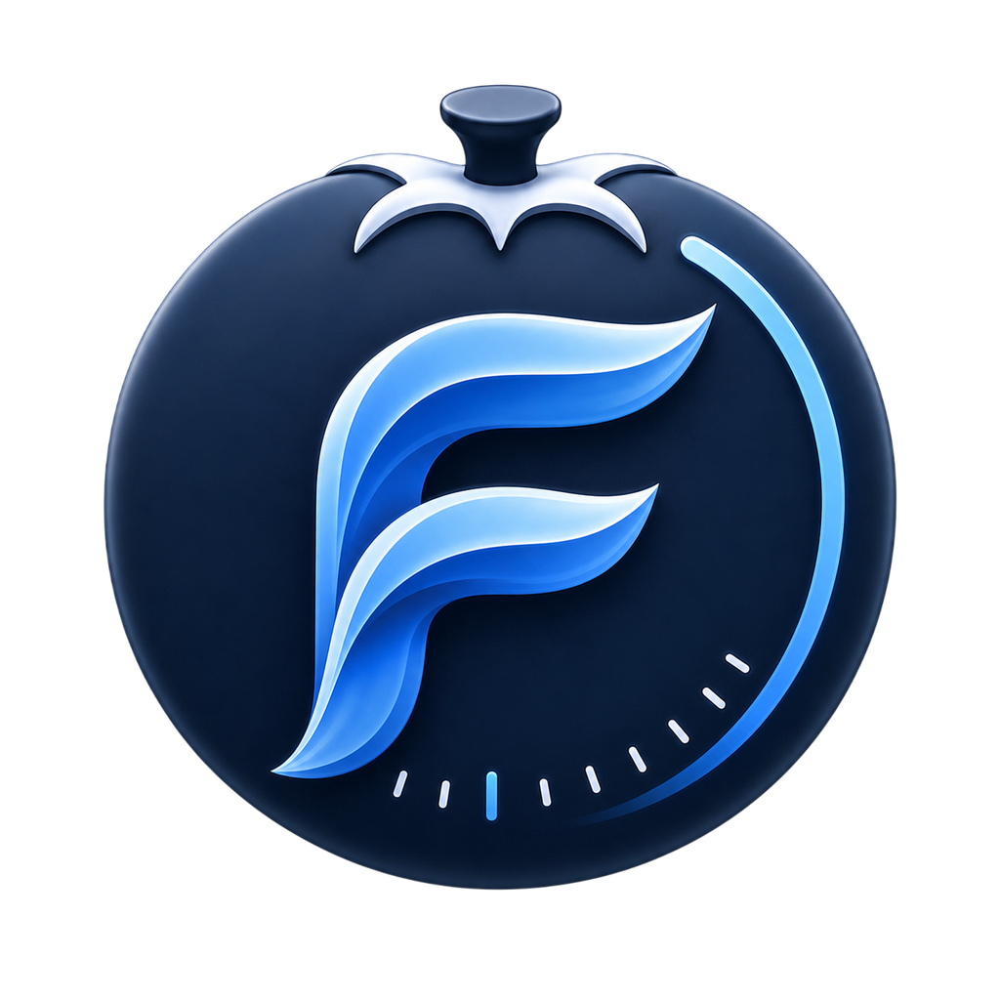

<p align="center">
  
</p>

<h1 align="center">Flow Fusion</h1>

<p align="center">A focused Pomodoro timer for your desktop — build sessions, run work/chill cycles, and track your focus over time.</p>

<p align="center">
  
  
</p>

---

Flow Fusion is a desktop focus app built with Flutter. You compose **sessions**
out of ordered **Work** and **Chill** blocks, run them with pause / resume /
skip, and get a desktop notification when each timer and the whole session
finishes. An analytics screen shows your total and daily focus time with a
year-long focus heatmap.

## Features

- **Focus sessions** — create sessions as sequences of Work and Chill timers.
- **Run controls** — start, pause, resume, and skip; state is restored on restart.
- **Desktop notifications** — alerts when a timer or a session completes.
- **Analytics** — total sessions, total / today focus time, average session, and a year-long focus heatmap.
- **System tray** — close to tray and keep timers running; show window or quit from the tray.
- **Themes & languages** — system / light / dark themes, English and Russian.
- **Automatic updates (OTA)** — in-app update banner with a localized "What's new" changelog, plus a manual "Check for updates".
- **Built-in diagnostics** — file logging and a one-click log / diagnostics export in Settings.

## Platforms

Windows 10 / 11 and macOS 10.14+ (Mojave and newer).

## Install (beta testers)

Download the latest build from the
[Releases page](https://github.com/easyscripter/flow_fusion/releases) and
follow **[INSTALL.md](INSTALL.md)**. Builds are currently unsigned, so the first
launch needs a one-time Gatekeeper / SmartScreen bypass (covered in the guide).
After that, the app keeps itself up to date automatically.

## Development

Requires the Flutter SDK (pinned to **3.44.2** in CI) with desktop support enabled.

```bash
git clone https://github.com/easyscripter/flow_fusion.git
cd flow_fusion
flutter pub get
dart run build_runner build --delete-conflicting-outputs   # generate code
flutter run -d windows   # or: -d macos
```

Generated sources (`*.g.dart`, `*.config.dart`, `*.freezed.dart`, `lib/gen/`) are
not committed — run `build_runner` after cloning and after changing annotated code.

### Tech stack

Flutter · MobX (state) · get_it + injectable (DI) · froom over sqflite (database)
· go_router (navigation) · window_manager + tray_manager (desktop shell) ·
flutter_local_notifications · desktop_updater (OTA).

## Releasing

Pushing a `v*` tag runs `.github/workflows/release.yml`, which builds Windows and
macOS, publishes the OTA feed to GitHub Pages, and creates a GitHub Release with
the installable ZIPs. `.github/workflows/ci.yml` runs analysis on every push/PR.

## License

Flow Fusion is **source-available, not open source**. It is licensed under the
**[PolyForm Noncommercial License 1.0.0](LICENSE.md)**: you may use, modify, and
share it for noncommercial purposes only. The copyright holder retains all
commercial rights. See [LICENSE.md](LICENSE.md) for details.

## Support & feedback

Found a bug or have a suggestion? Please open a
[GitHub issue](https://github.com/easyscripter/flow_fusion/issues/new) and attach
your log file and diagnostics — see the *Reporting problems* section of
[INSTALL.md](INSTALL.md) for how to grab them from **Settings → Diagnostics**.
